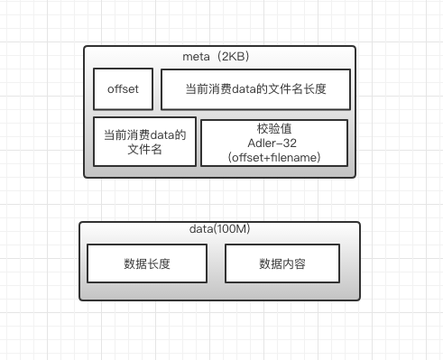
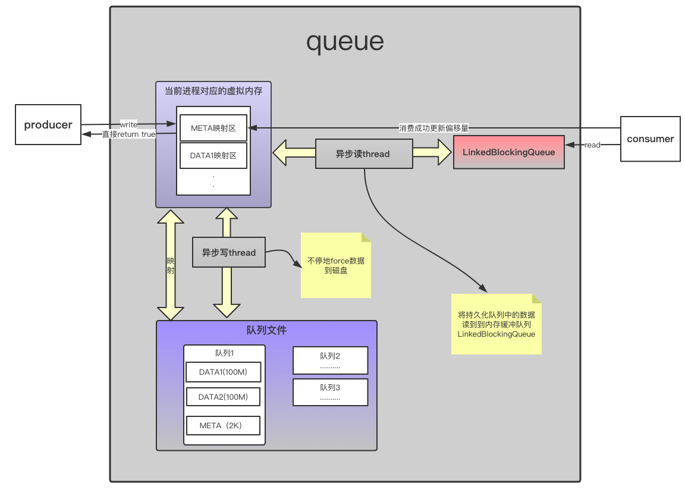

### cockburst
一个高性能,可靠,异步的本地持久化队列；可以做到重启JVM、重启服务器、或者强制KILL进程时,队列里的数据不丢失,下次启动应用时,仍可以继续消费；当然，天有不测风云，在机器由于不可抗拒的原因---例如断电,地震，机房着火，网管跑路，也是会有丢数据的风险的;
### 背景
很多时候，我们都会通过blockqueue来提高系统的吞吐量，解耦流程---也就是生产者，消费者模式；但因为blockqueue是非持久化的，一旦应用重新部署或者重启，队列中还有未消费完的数据，数据就没了;老王说“不能让贫穷限制了我们的想象”，这句话还是非常靠谱的，所以我们就写了这么个玩意，“cockburst” 即可以在保证性能情况下又可以解决在服务器重启时数据丢失的问题;原理就是---通过MMAP读写文件时，JAVA进程直接建立起某一段虚拟地址空间和文件对象的关联映射关系，实现这样的映射关系后，进程就可以采用指针的方式读写操作这一段内存，而系统会自动回写脏页面到对应的文件磁盘上，即完成了对文件的操作而不必再调用read,write等系统调用函数。相反，内核空间对这段区域的修改也直接反映用户空间，对文件的读写就像在内存中读写一样。这样就算应用抽风DOWN掉或者重启，操作系统依然会帮你把数据force到磁盘上;

### 队列设计
小时候最害怕两样东西，一个警察，一个是大灰狼；那时候就祈愿发誓，长大了一定要成为至少两样中的一样，结果哪样都没成；想事情不能太极端，程序设计也一样；队列读写性能和数据的完整性和安全性都要兼顾，不能捡了这个扔那个；队列的实现比较简单，只有两个文件：meta文件和data文件;meta用来描述队列消费的偏移量,也就是offset;data文件作为队列数据真正的存储数据块,大小100M一个数据块，一个队列可能有多个数据块，这个没有限制,当然,消费完的数据块也会删除,并不会白白占用硬盘空间;系统将要记录的数据先行顺序写，便直接给业务系统返回调用成功;单独刷数据的write线程将数据force到磁盘上(就算不起线程,操作系统也会以一定的策略帮你force刷);消费数据时,如果消费成功，更新本地索引文件META。这样既可以使存储生产数据对业务系统的操作性能影响降到最低，又保证了数据的完整性和安全性。

* xxxxxxxx.meta内容:offset(已消费当前数据块的偏移量)+消费当前数据块名称的长度+消费当前数据块名称（xxxxxxxx.data）+校验值（采用adler-32算法(offset+当前数据块名称)）
* xxxxxxxx.data内容:(数据A长度+数据A内容)+(数据B长度+数据B内容)+...........

### 方案设计

执行流程如下：
* 系统启动第一次写，初始化队列：
    1. 本地无队列，建立索引文件，数据文件；
    2. 本地已有队列，建立映射channel；
    3. check meta文件校验值，如果校验失败，该数据块的偏移量设置为0，也就是文件头；
* 判断文件块是否还有剩余空间（限制100M），有则写入，无则重新建立数据块xxxx.data；
* 启动刷数据write thread,就是while(true)操作，不停的刷虚拟内存到磁盘文件；
* 启动read thread,while(true)操作，通过映射channel将数据缓存至内存LinkedBlockingQueue；
* 消费者从LinkedBlockingQueue take数据，通过映射channel更新索引文件xxxx.meta;
* 更新索引文件xxxx.meta时，判断offset是否是0；如果为0，触发删除已消费完的.data文件，释放磁盘空间；

### 如何使用
使用起来也非常简单方便:
* 在resources目录新建profiler.properties文件,在文件中定义两个属性:
1. 队列文件data的存储目录;
2. 索引文件meta的存储目录;
3. 如果应用docker了以后，一定要把这两个路径VOLUME一下；
* 直接调用com.alibaba.profiler.queue.PermanentQueue.offer()或者
com.alibaba.profiler.queue.PermanentQueue.take();其中offer()和
take()的语义与blockqueue的语义是一样的;
* 可参照测试用例使用;com.alibaba.profiler.QueueTest#testOffer com.alibaba.profiler.QueueTest#testTake

### 性能
本地用自己的电脑air测试了一下：同一个队列，100个线程连续写,每个线程写10W条数据，写的TPS 210W/s,  读的TPS 38W/s;
